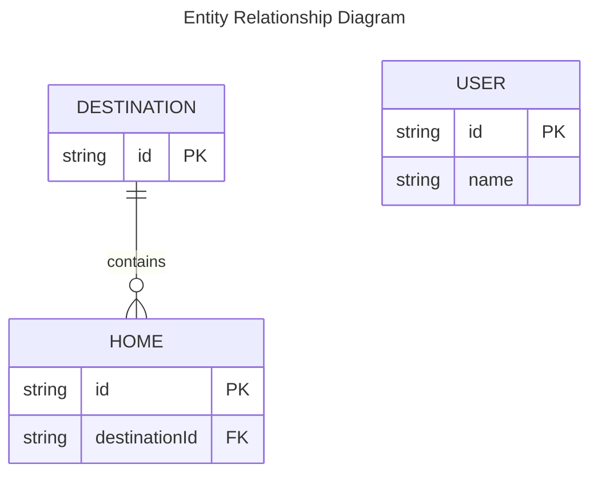
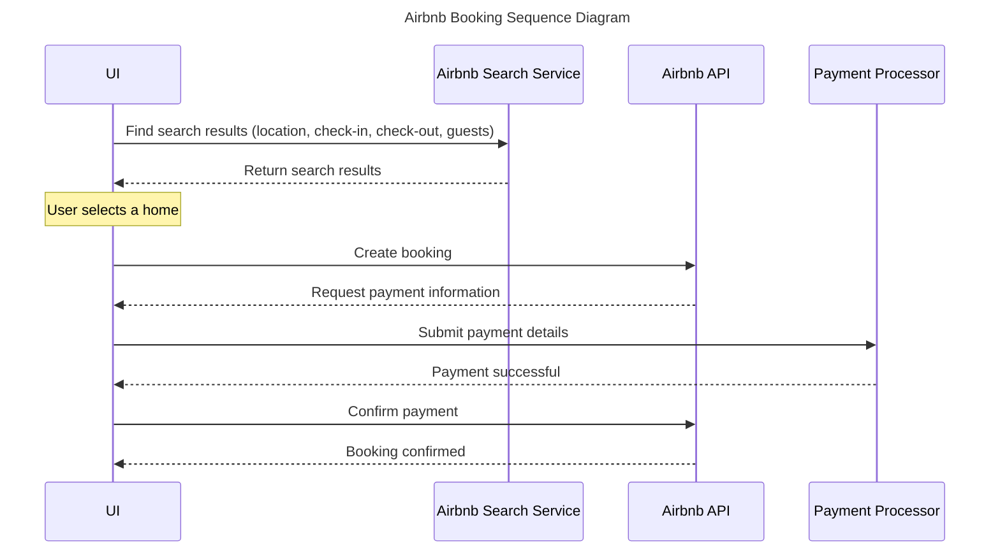
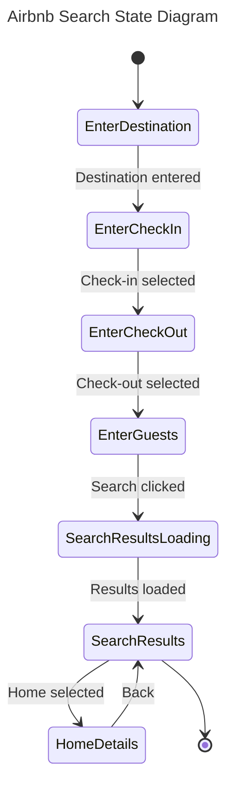

# Diagrams

## Entity relationship

```mermaid
---
title: Entity Relationship Diagram
---

erDiagram
    DESTINATION {
        string id PK
    }

    HOME {
        string id PK
        string destinationId FK
    }

    USER {
        string id PK
        string name
    }

    DESTINATION ||--o{ HOME : contains
```

## Sequence diagram

```mermaid
---
title: Airbnb Booking Sequence Diagram
---

sequenceDiagram
    participant UI
    participant Search as Airbnb Search Service
    participant API as Airbnb API
    participant Payment as Payment Processor

    UI->>Search: Find search results (location, check-in, check-out, guests)
    Search-->>UI: Return search results

    Note over UI: User selects a home

    UI->>API: Create booking
    API-->>UI: Request payment information

    UI->>Payment: Submit payment details
    Payment-->>UI: Payment successful
    UI->>API: Confirm payment
    API-->>UI: Booking confirmed
```

## State diagram

```mermaid
---
title: Airbnb Search State Diagram
---

stateDiagram-v2
    [*] --> EnterDestination

    EnterDestination --> EnterCheckIn : Destination entered
    EnterCheckIn --> EnterCheckOut : Check-in selected
    EnterCheckOut --> EnterGuests : Check-out selected
    EnterGuests --> SearchResultsLoading : Search clicked

    SearchResultsLoading --> SearchResults : Results loaded

    SearchResults --> HomeDetails : Home selected
    HomeDetails --> SearchResults : Back

    SearchResults --> [*]
```
